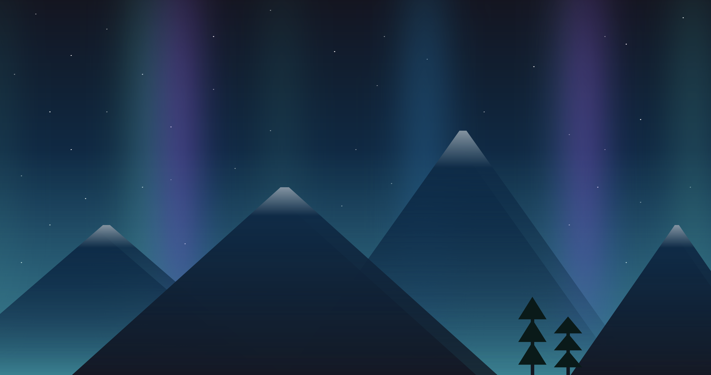

# Aurora Borealis

**Live Demo:** [https://codepen.io/aexcode/full/PoboqVW](https://codepen.io/aexcode/full/PoboqVW)

## Description:

An animated, pure CSS illustration of an Aurora Borealis passing through the snow tipped mountains.

## Tech:

HTML | SCSS

## About this Project:

This particular project was created for the [January 2021 Codepen Challenge - States of Matter: Plasma](https://codepen.io/challenges/2021/January).

My goal with this project was to get some practice designing full screen images and some additional practice with animation.
