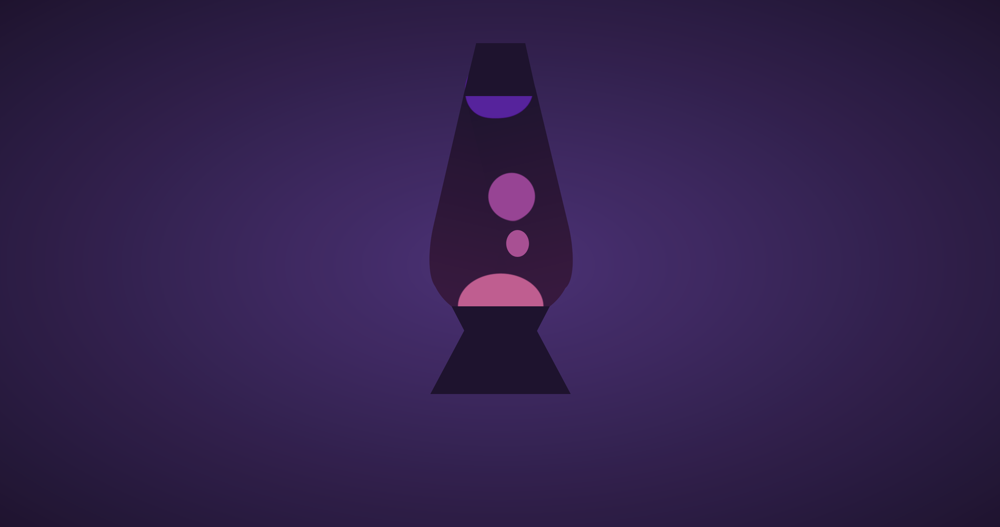

# Lava Lamp

**Live Demo:** [https://codepen.io/aexcode/full/wvzRNov](https://codepen.io/aexcode/full/wvzRNov)

## Description:

An animated, pure CSS illustration of a lava lamp. Visit the live demo to see it in motion.

## Tech:

HTML | SCSS

## About this Project:

This particular project was created for the [January 2021 Codepen Challenge - States of Matter: Plasma](https://codepen.io/challenges/2021/January).

The image itself was inspired by [Jess Lindsay on Dribbble](https://dribbble.com/shots/6947163-Lava-Lamp).

My goal with this project was to get some exposure to and hands on practice with the Gooey Effect.
