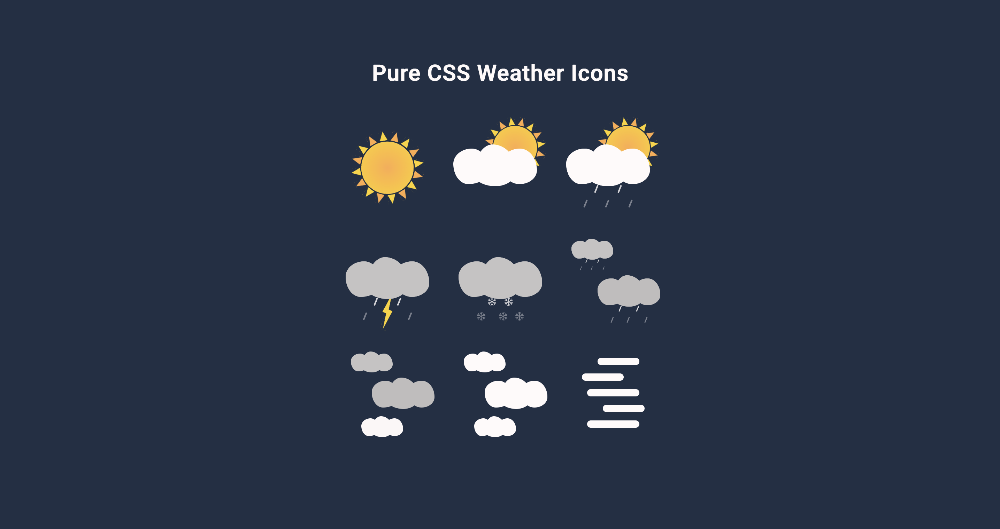

# Greedy Aliens

**Live Demo:** [https://codepen.io/aexcode/full/vYyQxoK](https://codepen.io/aexcode/full/vYyQxoK)

## Description:

A showcase of my animated, Pure CSS Weather Icons.

## Tech:

PUG | SCSS

## About this Project:

I created these weather icons to gain some more practice with Pure CSS and CSS animations. Though there's really no practical application for them, I also built a little weather app to help show them off. [Visit my Weather App](https://aexcode-daily-forecast.netlify.app/).

Feel free to check out each individual icon by visiting my [Weather Icons Collection](https://codepen.io/collection/DKjzqY) on Codepen. Or by clicking on any one of the weather icons in the [Live Demo](https://codepen.io/aexcode/full/vYyQxoK) (also hosted on Codepen).

## Future Updates:

- [ ] Use what I've learned since creating these icons to clean up my code for each individual icon as well as the showcase as a whole.
